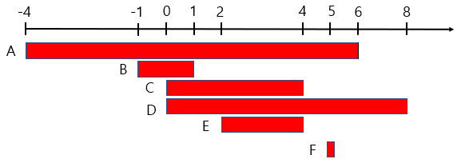

### 가장 큰 수
🔗 문제: https://school.programmers.co.kr/learn/courses/30/lessons/42746  
❗️ 배운점: 큰 수를 판가름하는 그 로직 .... x * 4를 생각해낼 수 있는 능력 할 수 있을까..  
```python
def solution(numbers):
    numbers = list(map(str, numbers))
    numbers.sort(key=lambda x: int((x*4)[0:4]), reverse=True)
    return str(int(''.join(numbers)))
```

### 입국심사
🔗 문제: https://school.programmers.co.kr/learn/courses/30/lessons/43238  
❗️ 배운점  
1. input의 길이가 지나치게 길다. 리스트의 길이가 100,000명 이하이며 하나의 input의 값이 1,000,000,000 이하이다.
2. **특정 값**(시간, 가격 ...)을 찾아야 한다.  

➡️ **혹시 `이진탐색`을 의심해보자**

3. 그리고, 시간 하나하나 셀 생각을 했지 이분 탐색이 가능한 생각을 전혀 못했다. 사람을 하나하나 더해갈 생각을 했지 시간에서 사람을 구할 생각을 못했다.

```python
def solution(n, times):
    left = 1
    right = max(times) * n

    while left <= right:
        mid = (left + right) // 2
        people = 0

        for time in times:
            people += mid // time

            if people >= n:
                break

        if people >= n:
            answer = mid
            right = mid - 1
        else:
            left = mid + 1
    return answer
```

### 징검다리
🔗 문제: https://school.programmers.co.kr/learn/courses/30/lessons/43236  
❗️ 배운점
1. left, right, mid를 이용한 이분 탐색의 대상을 문제에서 물어본 "징검다리 각 지점 사이의 거리의 최소값 중에 가장 큰 값"으로 잡았다.
2. 확실히 이분 탐색안에 전체 rock 반복문을 돌리니까 시간 복잡도가 확 줄어드는 것 같다.
```python
    while left <= right:
        mid = (left + right) // 2

        delete = 0
        pre_rock = 0 # 이전 바위의 위치
        for rock in rocks:
            dist = rock - pre_rock
            if dist < mid:
                delete += 1

                if delete > n:
                    break
            else:
                pre_rock = rock

        if delete > n:
            right = mid - 1
        else:
            answer = max(answer, mid)
            left = mid + 1
```

### 징검다리 건너기
🔗 문제: https://school.programmers.co.kr/learn/courses/30/lessons/64062  
❗️ 배운점: 간단하게 한다고 문자열 변환과 조인 연산을 수행하였는데 이게 오버 시간의 원인이 된 것 같다. 그래서 for문으로 바꾸고, 중간에 조건이 맞지 않으면 break하는 방식으로 변경하였다.
```python
        consecutive = 0
        for stone in stones:
            if stone <= mid:
                consecutive += 1
            else:
                consecutive = 0

            if consecutive >= k:
                break
```

### 베스트앨범
🔗 문제: https://school.programmers.co.kr/learn/courses/30/lessons/42579  
❗️ 배운점: 딕셔너리의 정렬은 다음과 같다. `총_재생_횟수 = sorted(총_재생_횟수.items(), key=lambda item: item[1], reverse=True)`  
(.items()는 딕셔너리의 모든 키-쌍을 튜플로 반환한다.)

### MaxCounters
🔗 문제: https://app.codility.com/programmers/lessons/4-counting_elements/max_counters/start/
1. 배운점: O(n)의 시간복잡도를 가지는 max 함수를 매번 호출할 필요가 뭐있어? 변수에 저장해두면 되지.
```python
def solution(N, A):
    result = [0] * N

    max_value = 0
    for i in range(len(A)):
        if A[i] == N + 1:
            result = [max_value] * N # [max(result)] * N
        else:
            result[A[i] - 1] += (1 + max_value)
            if result[A[i] - 1] > max_value:
                max_value = result[A[i] - 1]

    return result
```
2. 배운점: 최대한 변수에 저장해서, O(n^2)를 만들지 말자.
```python
def solution(N, A):
    result = [0] * N

    max_value = 0
    last_update = 0
    for i in range(len(A)):
        if 1 <= A[i] <= N:
            if result[A[i] - 1] < last_update:
                result[A[i] - 1] = last_update
            result[A[i] - 1] += 1
            if result[A[i] - 1] > max_value:
                max_value = result[A[i] - 1]
        else:
            last_update = max_value

    for i in range(len(result)):
        if result[i] < last_update:
            result[i] = last_update

    return result
```

### Triangle
🔗 문제: https://app.codility.com/c/run/trainingX4FUTA-4TC/
❗️ 배운점: 100000개의 배열에서 3개 조합을 찾는 것은 n^3의 시간복잡도에 가까운 일이므로 불가능하다.  
또한, 다음의 조건을 만족하기 위해서는 인접한 인덱스만 비교하면 된다. 따라서, O(n)의 시간복잡도로 풀 수 있다.
- A[P] + A[Q] > A[R],
- A[Q] + A[R] > A[P],
- A[R] + A[P] > A[Q].

### NumberOfDiscIntersections
🔗 문제: https://app.codility.com/programmers/lessons/6-sorting/number_of_disc_intersections/start/
❗️ 배운점: 문제를 푸는 방식을 아예 생각을 못했다. 정렬을 하다니 .. 그리고 겹치는 부분을 1씩 늘려가다니 ..
  
(출처: https://lipcoder.tistory.com/197)

```python
def solution(A):
    events = []
    for i, v in enumerate(A):
        events.append(((i - v), -1))
        events.append(((i + v), 1))
    events.sort()

    result = 0
    count = 0

    for i in range(len(events)):
        if events[i][1] == 1:
            count -= 1
        elif events[i][1] == -1:
            result += count
            count += 1

        if result > 10000000:
            return -1
    return result
```

### NumberOfDiscIntersections
🔗 문제: https://app.codility.com/programmers/lessons/7-stacks_and_queues/fish/   
❗️ 배운점: 상류로 올라가는 물고기가 한 물고기를 먹고 그 뒤에 있는 물고기도 먹을 수 있다는걸 고려하지 못했다.. !!! 틀린 이유는 꼼꼼히 적으면서 문제를 보지 않아서 그런듯 하다.
```python
def solution(A, B):
    queue = deque()

    for i in range(0, len(A)):
        if B[i] == 1:
            queue.append((B[i], A[i]))
        else: # B[i] == 0:
            queue.append((B[i], A[i]))
            j = len(queue) - 1
            while 0 <= j <= len(A) - 1:
                if queue[j - 1][0] == 1:
                    elem_j = queue.pop()
                    elem_j_1 = queue.pop()
                    if elem_j[1] > elem_j_1[1]:
                        queue.append(elem_j)
                        j -= 1
                    else:
                        queue.append(elem_j_1)
                        break
                else: # queue[j - 1][0] == 0:
                    break

    return len(queue)
```

### StoneWall
🔗 문제: https://app.codility.com/programmers/lessons/7-stacks_and_queues/stone_wall/  
❗️ 배운점: all을 사용하면 O(n^2)이 될 수 있다. 문제를 푸는 방식을 아예 생각을 못했다. 사실 시간복잡도를 많이 줄였음에도 타임에러가 발생했다. 그럴만 하다. 다음 해설 코드에서는 리스트를 한번만 읽고 답을 내기 때문이다.  
많이 예시를 그려보고 원리를 찾으면 될까?  

**이 문제에서 사용한 방식은 다음과 같다. 스택을 이용하고 이전의 블럭보다 큰 블럭을 세우고자 하면 blockCount를 올린다.**

```python
def solution(H):
    blockCount = 0
    blockStack = []

    for i in range(len(H)):
        while blockStack and blockStack[-1] < H[i]:
            blockStack.pop()

        if not blockStack or blockStack[-1] > H[i]:
            blockCount += 1
            blockStack.append(H[i])

    return blockCount
```